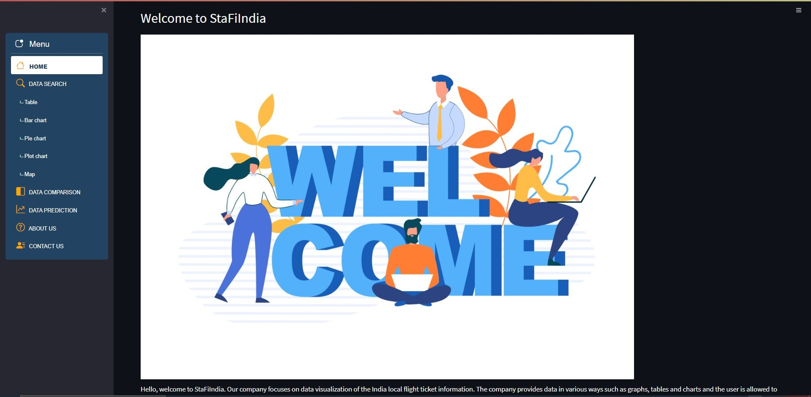

<h1>StaFlindia</h1>
This is a Data Visualisation and Machine Learning project during RMIT University. We develop StaFlindia - a web application for India Flight Data Analysis in a group of 5 members. The language used are Python, HTML and CSS.  

Link: https://share.streamlit.io/nhatnguyen3001/starflinda/main/apps.py  

## About us

    Semester A, 2022, COSC2634 Web Application For India Fight Data Analysis 
    
    <SGS_Group 7>

        - Lee Gain, s3878170

        - Phan Do Ngoc Linh, s3881557

        - Tran Hoang Phuc, s3911244

        - Nguyen Dang Nhat, s3878292

        - Vo Ngoc Diem Tien s3911365

##  Description of each folder
    1) folder for chart pages (table, line chart... etc):-BIIT-Project / app / grapch_pages /

    2) folder for other pages (search, data comparision... etc):-BIIT-Project / apps

    3) folder for data (.csv .txt): -BIIT-Project / lib / data /

    4) folder for image (png .jpg): -BIIT-Project / lib / img /

    5) folder for css file: -BIIT-Project / lib / style /

##  Image and icon source 
    Our team only used free images and icons for the project.

[    https://pixabay.com/photos/woman-asian-model-portrait-girl-5772021/ ](url)

[    https://pixabay.com/photos/smile-work-business-success-5047506/](url)

[    https://pixabay.com/photos/business-lady-woman-young-woman-3560921/ ](url)

[    https://www.freepik.com/vectors/illustrations](url)

[    https://icons.getbootstrap.com/](url)

##  Data source
[  https://www.kaggle.com/datasets/shubhambathwal/flight-price-prediction](url)

##  User Manual

https://docs.google.com/document/d/13ndKbFKlDVke8E6ybmQFKy63APymuuePcW_qrYNfudM/edit?usp=sharing
